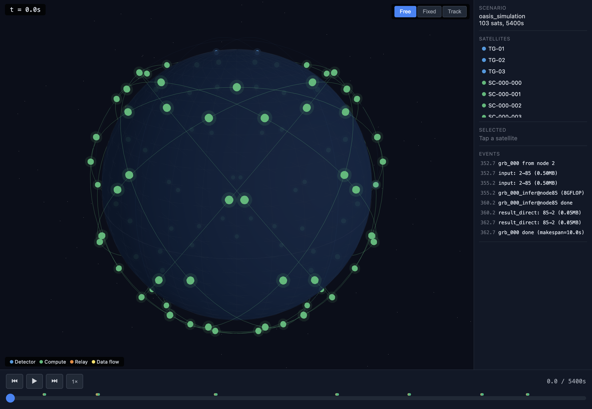

# SatLynk

**LEO 卫星星座任务调度仿真器** — 面向天基智能体的离散事件仿真平台

<p align="center">
  
</p>

## Background

随着天基计算从"天感地算"走向"天感天算"，在轨 AI 推理成为现实需求。但 LEO 卫星星座面临独特的调度挑战：

- **通信窗口时变**：卫星之间的链路受轨道几何约束，每次接触窗口仅数分钟
- **能耗刚性约束**：太阳能供电 + 地影周期性断供，电池容量有限
- **模型权重部署**：大模型权重需预先缓存到目标节点，"搬权重"本身消耗带宽
- **实时性要求**：科学观测事件（如伽马射线暴）有严格的响应时间窗口

SatLynk 聚焦于这一调度问题的建模与仿真——给定星座构型、任务流、约束条件，评估不同调度策略的可行性和性能。

## Core Scenario

**天格计划 × 三体计算星座：GRB 在轨推理**

| 角色 | 卫星 | 参数 |
|------|------|------|
| 探测星 | 天格 GRID-10B/11B | 535km SSO, SiPM+CsI 探测器, 100 MFLOPS MCU |
| 计算星 | 三体计算星座 | 550km 53°, 100 TOPS INT8, 星间激光互联 |

任务流：GRB 触发 → MCU 预处理 → **500KB 上传 (2Mbps)** → **2B 模型推理 (8ms)** → 50KB 回传 → 决策执行

### 仿真结果

| 场景 | 计算星规模 | 成功率 | 平均延时 | 关键发现 |
|------|-----------|--------|---------|---------|
| 稀疏星座 | 4 颗 | **17%** | 3.0s | 链路门控 (C2) 主导，大部分触发时刻无可达计算星 |
| 三体最终形态 | 2800 颗 | **92%** | 24.8s | 星座密度是解决时空可达性的根本途径 |
| 展示版 | 100 颗 | **100%** | ~20s | ~87% 时间步可达，覆盖临界点在 50-100 颗 |

## Features

- **离散事件仿真引擎** — 事件驱动 + 时间步混合，支持 idle 时自动跳步
- **轨道力学** — Keplerian 二体传播 + Walker-Delta 星座生成
- **通信模型** — 距离 + 视线 (LoS) 判定，自动生成 Contact Plan
- **地影模型** — 柱形阴影 + 向量化计算，影响光伏充电
- **能耗模型** — 电池动力学（充/放电）+ 多功耗模式
- **权重缓存** — C4 约束（计算前模型必须到位），LRU/LFU 淘汰策略
- **可插拔调度器** — Nearest-First baseline，接口支持自定义策略
- **3D 可视化** — Three.js 地球 + 卫星轨道 + 任务流播放（单 HTML 文件，零依赖）

## Quick Start

### 环境要求

- Python ≥ 3.11
- NumPy

```bash
git clone https://github.com/yuyangJin/SatLynk.git
cd SatLynk
pip install numpy   # 唯一依赖
```

### 运行场景

```bash
# 天格 GRB 场景 — 3 探测星 + 4 计算星 (演示链路瓶颈)
python -m satlynk.scenarios.tiange_grb

# 2800 星全规模场景 (约 10s 完成)
python -m satlynk.scenarios.tiange_2800

# 基础 toy case — 3 星接力验证
python -m satlynk.scenarios.toy_case_pure
```

### 生成 3D 可视化

```bash
python -m satlynk.viz.generate_tiange
# 输出 → site/index.html，用浏览器打开即可
```

### 运行测试

```bash
python -m satlynk.tests.test_integration
python -m satlynk.tests.test_walker_5sat
python -m satlynk.tests.test_phase2
```

## Architecture

```
satlynk/
├── core/
│   ├── engine.py          # DES 事件引擎
│   └── simulator.py       # 主仿真器（集成所有模块）
├── orbital/
│   ├── constellation.py   # Walker 星座生成 + 轨道传播
│   └── eclipse.py         # 地影计算
├── network/
│   └── contact_plan.py    # 通信窗口预计算
├── task/
│   ├── dag.py             # Task DAG 数据结构
│   └── weight_cache.py    # 模型权重缓存管理
├── scheduler/
│   └── interface.py       # 调度器接口 + Nearest-First
├── energy/
│   └── battery.py         # 电池 + 光伏模型
├── metrics/
│   └── collector.py       # 仿真指标收集
├── viz/
│   ├── exporter.py        # JSON 数据导出
│   ├── build_frontend.py  # Three.js HTML 生成
│   └── generate_tiange.py # 天格场景可视化
├── scenarios/
│   ├── tiange_grb.py      # 3+4 星 GRB 场景
│   ├── tiange_2800.py     # 3+2800 星全规模
│   └── toy_case_pure.py   # 3 星接力基础验证
└── tests/
    ├── test_integration.py
    ├── test_walker_5sat.py
    └── test_phase2.py
```

## Formal Model

仿真器实现了以下形式化调度问题的约束：

| 约束 | 含义 | 实现 |
|------|------|------|
| C1 | 执行唯一性：每个子任务恰好在一个节点执行一次 | TaskAssignment |
| C2 | 链路门控：传输只能在通信窗口内发生 | ContactPlan + LINK_UP/DOWN 事件 |
| C3 | 依赖就绪：输入数据到达后才能开始计算 | Transfer → Compute 事件链 |
| C4 | 权重前置：模型权重必须预先缓存在目标节点 | WeightCacheManager |
| C5 | 能量动力学：电池 SoC 不能降到 0 | EnergyModel + eclipse |
| C6 | 存储约束：节点缓存容量有限 | LRU/LFU eviction |

## License

MIT
